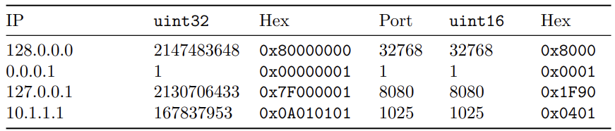

# Specifiche

Scrivere un sistema che consente di scambiare dati su indirizzi IP e numeri di
porta in formato binario.
Nello specifico si vogliono creare un client e un server che scambiano questo tipo
di dati.

### Client

Il client deve accettare due parametri da linea di comando:

- un indirizzo IPv4 in formato dotted decimal notation
- un numero di porta

Per esempio il client può essere invocato con questi parametri.

```bash
./client.py 128.0.0.0 8080
```

Quando invocato, il client aprirà una connessione TCP con il server che gira sulla porta 1025 del server con indirizzo IP 127.0.0.1.

Il client dovrà inviare un messaggio così composto:
- Indirizzo IP convertito in unsigned int a 32 bit e rappresentato in network format (ovvero in formato big endian).
- Byte nullo (ovvero \0)
- Numero di porta convertito in unsigned short int a 16 bit e rappresentato in network format (ovvero in formato big endian)
- Byte nullo (ovvero \0)

Dopo aver mandato il messaggio, il client dovrà mostrare su standard output le informazioni sui byte spediti. Di seguito un esempio dell’output atteso:

```bash
$ ./client 128.0.0.0 32768
IP is 128.0.0.0; uint32 is 2147483648
Port is 32768; uint16 is 32768
```

### Server

Il server dovrà porsi in ascolto sulla porta 1025 in attesa di messaggi da parte
del client. Alla ricezione dei dati del client il server dovrà leggere i dati come
unsigned int a 32 bit e unisgned short int a 16 bit. Successivamente dovrà
inviare su standard output l’indirizzo IP convertito in dotted decimal notation e
il numero di porta. Facendo riferimento all’esempio, il server dovrà stampare:

```bash
$ ./server
uint32 is 2147483648; IP is 128.0.0.0
uint16 is 32768; Port is 32768
```

**Elementi di valutazione:**
- Gestione dell’input da riga di comando
- Conversione dei dati in network format
- Invio dei dati sulla rete
- Corretto output del client
- Corretta ricezione da parte del server
- Corretto output del server
- Correttezza dei dati che transitano sulla rete (verificato con wireshark o tcpdump)

